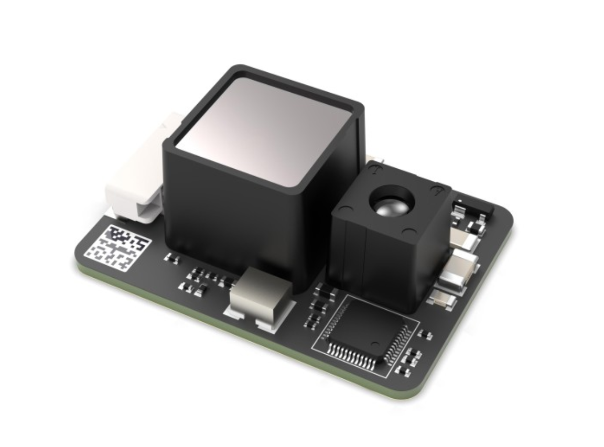

# DTS6012M TOF module
The [DTS6012M TOF module](https://item.taobao.com/item.htm?id=751037798640&spm=a21m98.27004841&skuId=5176533692473) is a long range, inexpensive & compact LIDAR sensor. 



# Datasheet
- [DTS6012M Datasheet (Chinese)](DTS6012Mdatasheet.pdf)

# Using the library
### DTS6012M sensor struct
The `DTS6012M` struct holds the I2C handle and raw 16-bit sensor data.

```
typedef struct
{
    I2C_HandleTypeDef* i2c_handle;
    uint16_t raw_data;
} DTS6012M;
```

### Functions
- `DTS6012M_Init(DTS6012M* dev, I2C_HandleTypeDef* i2c)` : Initialize sensor struct with I2C handle
- `DTS6012M_StartLaser(DTS6012M* dev)` : Switch on on-board laser (start measuring)
- `DTS6012M_StopLaser(DTS6012M* dev)` : Switch off on-board laser (stop measuring)
- `DTS6012M_GetDistance(DTS6012M* dev)` : Get distance reading in meters

### Macros
In `DTS6012M.h`:
- `DTS6012M_SCALING_FACTOR` : Adjust scaling factor when converting raw sensor data to meters
- `DTS6012M_OFFSET_DISTANCE` : Adjust sensor offset distance